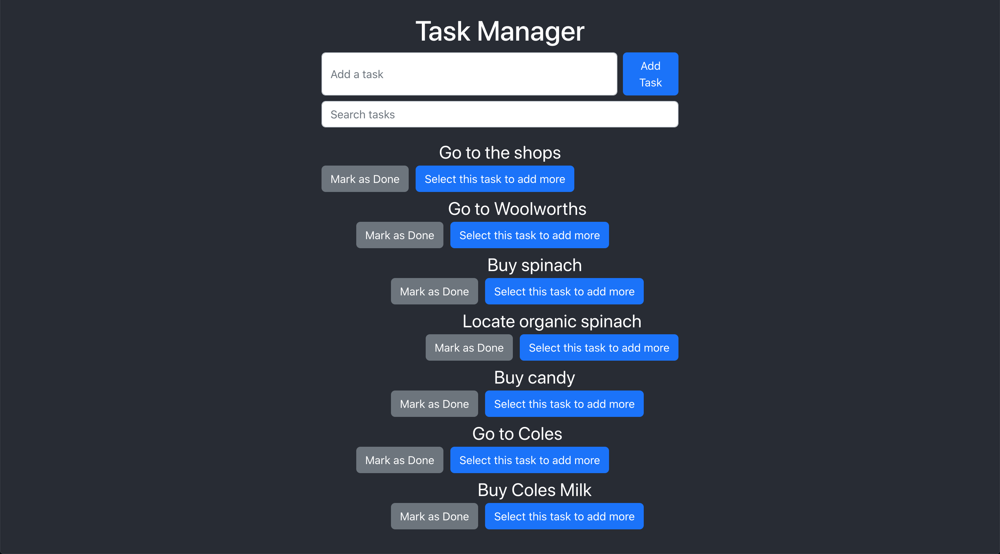

# TODOs React App


<video src='https://user-images.githubusercontent.com/33816630/236242186-5afca6c2-7889-432b-8a6f-8abbe32bf967.mov' width=180/>
The recording is also accessible at this path from the root of the repo: ./media/recordig.mov

This app is a nested to-do list in React that uses Redux to manage the application state.

Operations:

- Create a task
- Create 0...n number of tasks under any task
- Removal of a

task when marked as done

- When a parent task is marked as done all child tasks underneath it should
  be removed as well
- Search tasks (if a task matches, all nested tasked underneath it will still persist).

## Installation

```
nvm use # either use nvm or make node 18 is installed
```

```
cd todos
npm install
```

```
npm run start
```

You can now access the app at http://localhost:3000

Running E2E tests:

These commands must run in a separate terminal as we need the local dev server live.

From the root of the repo in a new terminal:

```
cd todos
```

```
npm run cypress:open
```

- Click on "E2E testing"
- Click on "Chrome" and then "Start E2E Testing in Chrome"
- A browser should popup. Click on "task_manager_spec.cy.ts"

The tests should now run.

To run in headless mode instead:

```
npm run cypress:run
```

## Future work

Due to the time limitation, I havde decided to descope the following work:

- Add unit tests
- Refactor and breakdown TaskManager into smaller reusable components
- i18n support
- Backend integration
